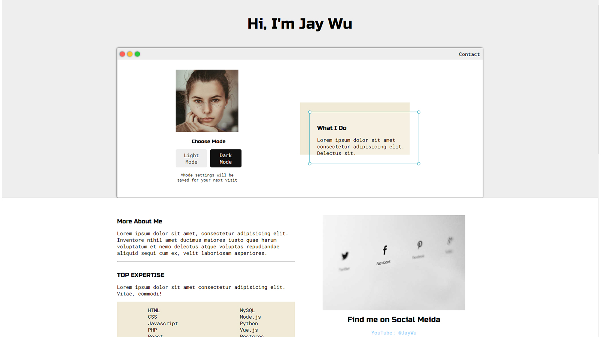

# Portfolio Site Clone

This is my first project. It's not so difficult. It's also my first clone project. There will be more clones coming. One thing special about this site is a simple mode switch feature. The page can be rendered either in light mode or dark mode. User's mode choice is stored in local storage. It will be remembered and automatically applied next time the user visits.

### _Why and how do I do site clones?_

First I pick a web site neither too easy nor too hard for me at the moment. It should at least has one special feature or one highlight that attracts me to clone it.

Then I would take a peek at the color and fonts the site uses, and that's it. I fulfill everything I see with my own CSS and Javascript.

Right now, I will mostly focus on the appearance of the web site. I will try to make my clone looks alike the original. I think this could be a good way to help me refresh my CSS and basic Javascript skills while I move on and learn new stuff.

