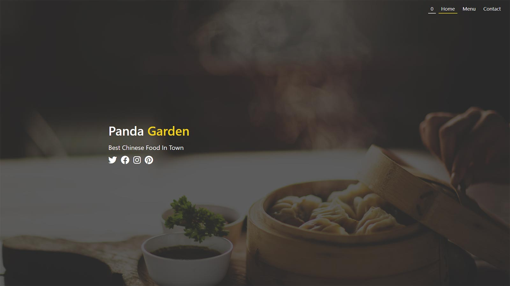

# Chinese Restaurant Website

This is the first design project. It might not be perfect, but I think it's got nice appearance. There is a localstorage based shopping cart, which is working pretty well. The logic behind this requires a little bit more Javascript than my last portfolio clone project. I tried Js module this time. Also my first time to embed a Google map on a webpage. Last but not least, I used SASS to style everything, which was a lot of fun.

